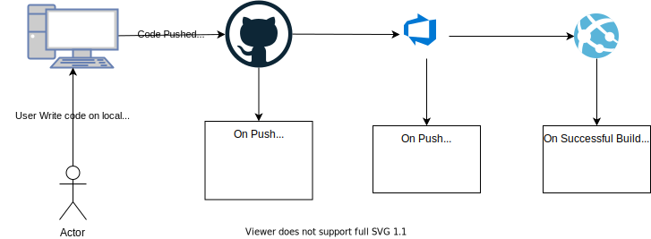
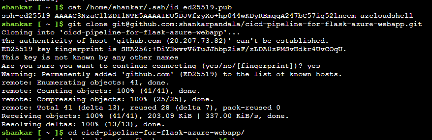
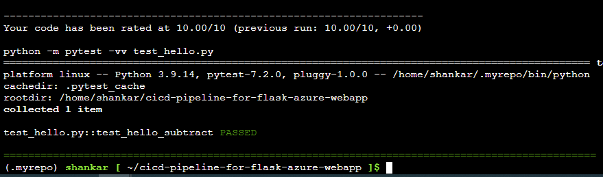
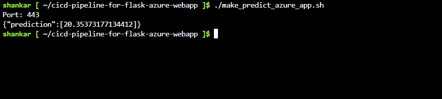
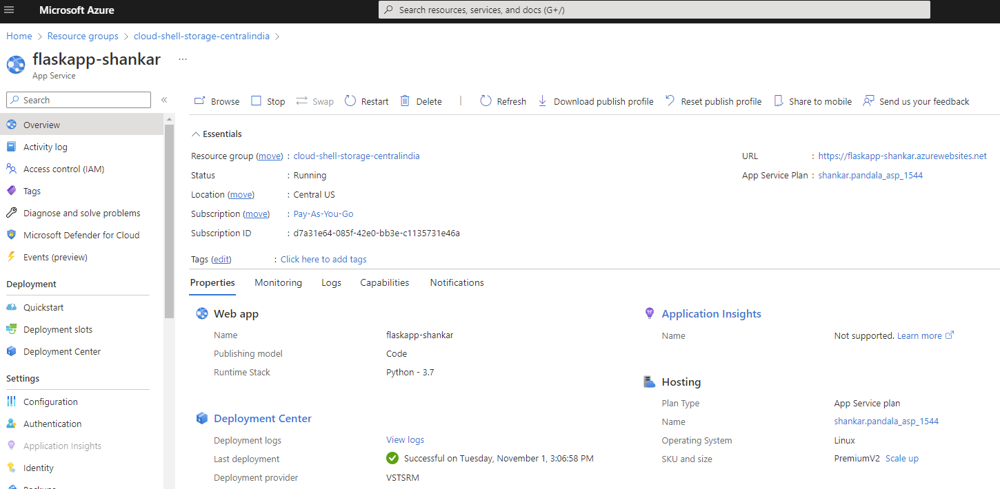
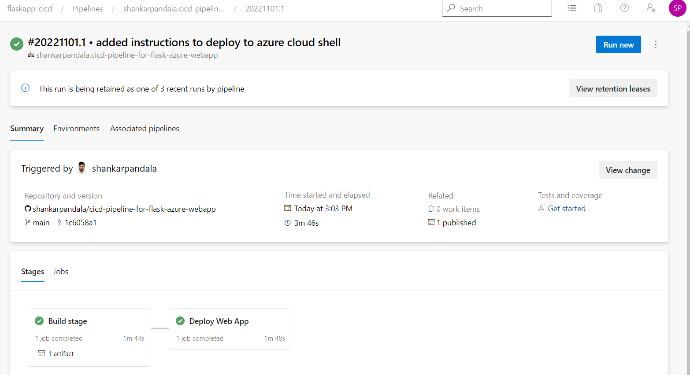
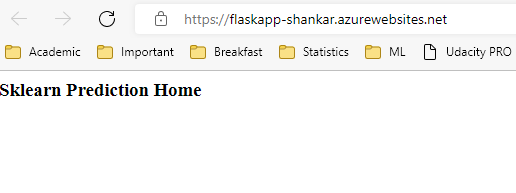

# cicd-pipeline-for-flask-azure-webapp

[](https://github.com/shankarpandala/cicd-pipeline-for-flask-azure-webapp/actions/workflows/python-app.yml)

# Introduction
This project, 'Building a CI/CD Pipeline' is created as part of the Advanced Data Engineer Nano degree program offered by Shell as a scholarship program to train and hire data engineers

This project contains a python application that is designed to predict housing prices in Boston. 
- Deploy the app in Azure CloudShell
- Deploy the app as an Azure App Service

Commiting to this repo will trigger
- Github Actions to run tests
- Azure Pipeline to Build and deploy flask app to Azure App service


Here is an architectural diagram:


Trello Board for task tracking : [Trello](https://trello.com/b/md4zXvZU/building-a-cicd-pipeline)

Spreadsheet for project planning : [spreadsheet](images/project_plan.xlsx) 

Youtube link for the demo : [link](https://youtu.be/pf1By-W4LGY) 

# Instructions to run the project

## Deploy app to azure cloud shell
Clone the repo to azure cloud shell:
```
git clone git@github.com:bobfoster1299/building-a-cicd-pipeline2.git
```
 

Change into the new directory:
```
cd cicd-pipeline-for-flask-azure-webapp
```

Create a virtual environment:
```
make setup
```

Activate the virtual environment:
```
source ~/.udacity-devops/bin/activate
```

Install dependencies in the virtual environment and run tests:
```
make all
```
 

Start the application in the local environment:
```
python app.py
```

Open a separate Cloud Shell and test that the app is working:
```
./make_prediction.sh
```

The output should match the below:




## Deploy the app to an Azure App Service

Create an App Service in Azure. In this example the App Service is called flaskapp-shankar and the resource group is called cloud-shell-storage-centralindia:
```
az webapp up -n flaskapp-shankar -g cloud-shell-storage-centralindia
```

Screenshot of the App Service in Azure:



Create a pipeline in Azure DevOps.The basic steps to set up the pipeline are:

- Go to [https://dev.azure.com](https://dev.azure.com) and sign in.
- Create a new project.
- Under Project Settings create a new service connection to Azure Resource Manager, scoped to your subscription and resource group.
- Create a new pipeline linked to your GitHub repo.


Screenshot of a successful run of the project in Azure Pipelines:



To test the app running in Azure App Service, edit line 28 of the make_predict_azure_app.sh script with the DNS name of your app. Then run the script:
```
./make_predict_azure_app.sh 
```

If it's working you should see the following output:


You can also visit the URL of the App Service via the browser and you should see the following page:




## Next Steps
- Separate deployments for development and production applications